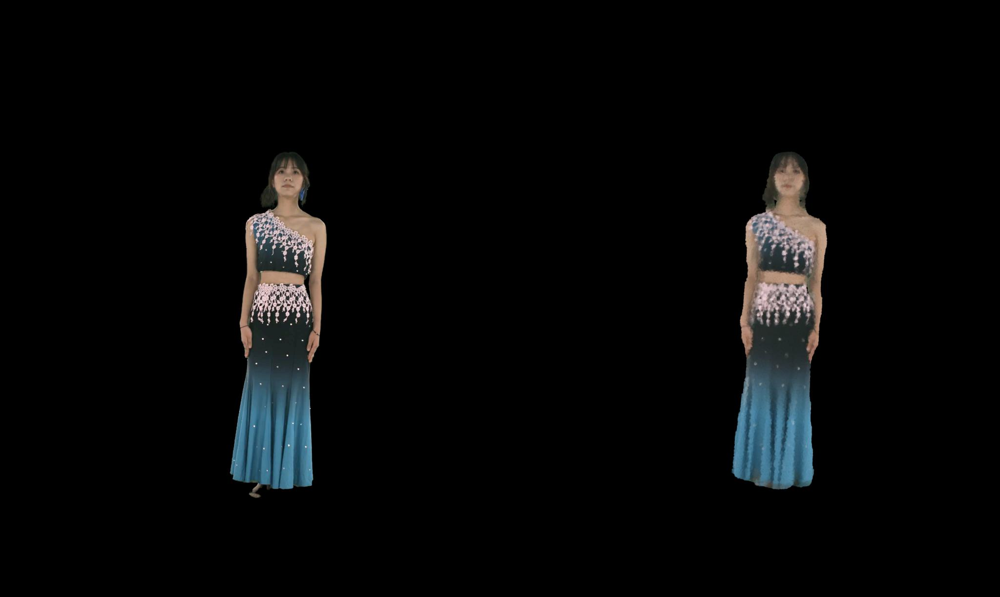

# Learning NeRF

This repository is initially created by [Haotong Lin](https://haotongl.github.io/).
Forked from [LearningNeRF](https://github.com/pengsida/learning_nerf)

## TODO

- [ ] use opengl-based renderer to implement the depth peeling
- [ ] try other backbones of the K-plane encoder
- [ ] use the easyvolcap to visualize the 4D volume video

## 4K4D Result

### test on single frame

after training for 400 iterations, the result is as follows:

PSNR: 29.90dB

### 30 frames

after training for around 2k iterations, the result is as follows:

